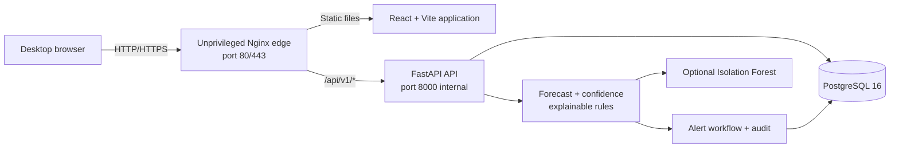

# Super Agent Liquidity & Risk Intelligence Platform

An explainable, synthetic-data decision-support platform for mobile financial service agents who operate with one shared physical cash reserve and separate provider e-money balances.

The application forecasts provider and shared-cash pressure, detects unusual transaction patterns, explains confidence and data-quality limitations, and gives operations teams an auditable human workflow from alert creation through resolution.

> **Synthetic demonstration data only.** This project does not connect to production providers, move money, block accounts, identify real customers, or make final fraud determinations.

## Contents

- [Features](#features)
- [Architecture](#architecture)
- [Technology stack](#technology-stack)
- [Quick start with Docker](#quick-start-with-docker)
- [Demo accounts and scenarios](#demo-accounts-and-scenarios)
- [Development setup](#development-setup)
- [Configuration](#configuration)
- [Testing and quality checks](#testing-and-quality-checks)
- [API and operational commands](#api-and-operational-commands)
- [Ubuntu demo-VM deployment](#ubuntu-demo-vm-deployment)
- [Troubleshooting](#troubleshooting)

## Features

- Shared physical cash displayed separately from every provider e-money balance.
- Provider and cash shortage forecasts using configurable 15- and 60-minute windows.
- Confidence penalties for delayed, missing, sparse, volatile, or conflicting data.
- Explainable anomaly detection:
  - repeated near-identical transactions;
  - transaction velocity spikes;
  - synthetic-identifier concentration;
  - failure-rate spikes;
  - activity outside operating hours;
  - ledger-versus-balance conflicts;
  - optional secondary Isolation Forest scoring.
- JWT authentication and backend-enforced Agent, Operations, Risk, Management, and Admin roles.
- Alert claim, acknowledgement, notes, escalation, resolution, reopen, and immutable timeline events.
- Deterministic demonstration scenarios A–D.
- English, Bengali, and Banglish explanation labels.
- What-if demand simulation, nearby-agent discovery, relationship evidence, CSV exports, and validation metrics.
- Docker Compose, Alembic migrations, health checks, GitHub Actions, and a systemd deployment unit.
- Optional OpenAI Responses API assistance for structured translation, summaries, and advisory next steps; disabled by default with deterministic fallback.

### Innovation highlights

- Reconciles transaction-ledger movement against immutable balance snapshots instead of overwriting history.
- Keeps explainable anomaly rules authoritative while using Isolation Forest only as a secondary signal.
- Separates measured facts, forecasts, uncertainty, and recommendations in both API and UI contracts.
- Adds safety-filtered structured AI without making core detection, workflow, or offline operation depend on a model provider.
- Defers free-form Q&A and AI note handover until a live safety evaluation passes.

## Architecture



### Request and data flow

1. Nginx serves the compiled React application and proxies `/api/` requests to FastAPI.
2. FastAPI validates the JWT, role, assigned scope, and request payload.
3. Scenario or imported transactions are stored in PostgreSQL using fixed-precision monetary fields.
4. Successful transactions update cash and provider balances using the documented cash-in/cash-out mechanics.
5. Forecast, confidence, anomaly, alert, and audit services run inside the backend.
6. The frontend receives measured facts, forecasts, uncertainty, and recommendations as distinct fields.

Provider balances are never combined as if they were transferable. Isolation Forest is a secondary review signal; the rule engine and human workflow remain authoritative.

More detail: [architecture](docs/architecture.md), [data simulation](docs/data-simulation.md), [responsible design](docs/responsible-design.md), [AI integration](docs/ai-integration.md), and the [PRD compliance matrix](docs/prd-compliance-matrix.md).

## Technology stack

| Layer | Technology |
| --- | --- |
| Frontend | React 18, TypeScript, Vite, React Router, TanStack Query, Recharts, optional Leaflet |
| Backend | Python 3.12, FastAPI, Pydantic v2, SQLAlchemy 2 async, SlowAPI |
| Analytics | Python rules, NumPy, scikit-learn Isolation Forest |
| Optional AI | OpenAI async SDK, Responses API, Pydantic structured outputs |
| Database | PostgreSQL 16, Alembic migrations |
| Edge | Unprivileged Nginx |
| Testing | pytest, HTTPX ASGI smoke tests, Vitest, Playwright |
| Deployment | Docker Compose, GitHub Actions, systemd |

## Quick start with Docker

### Prerequisites

- Git.
- Docker Engine or Docker Desktop with Docker Compose v2.
- At least 2 GB free RAM and enough disk space to build Python and Node images.
- Ports `80`, `8000`, and `5173` available as required by the selected mode.

### 1. Clone and configure

```bash
git clone https://github.com/ado1d/Hackathon-VibeJS-Super-Agent-Liquidity.git
cd Hackathon-VibeJS-Super-Agent-Liquidity
cp .env.example .env
```

On PowerShell:

```powershell
git clone https://github.com/ado1d/Hackathon-VibeJS-Super-Agent-Liquidity.git
Set-Location Hackathon-VibeJS-Super-Agent-Liquidity
Copy-Item .env.example .env
```

Edit `.env` and replace at minimum:

```dotenv
POSTGRES_PASSWORD=use-a-strong-random-password
JWT_SECRET=use-at-least-32-random-characters
```

Do not commit `.env`. It is intentionally ignored by Git.

### 2. Build and start

```bash
docker compose up -d --build
```

If the legacy standalone executable is installed instead:

```bash
docker-compose up -d --build
```

The backend automatically runs the Alembic migration and loads the healthy baseline when the database is empty.

### 3. Confirm service health

```bash
docker compose ps
curl http://localhost/api/v1/health
curl http://localhost/api/v1/ready
```

Expected health responses:

```json
{"status":"ok"}
```

```json
{"status":"ready","database":"reachable"}
```

### 4. Open the application

Visit <http://localhost>.

Sign in using a demo role, open **Demo control** as Admin, and load Scenario A, B, C, or D. For the complete presentation sequence, follow [docs/demo-script.md](docs/demo-script.md).

### 5. Stop or reset

```bash
docker compose down
```

This preserves PostgreSQL data in the `pgdata` volume. To remove the demo database as well:

```bash
docker compose down -v
```

`down -v` permanently removes the local Compose database volume; use it only when a completely fresh database is intended.

## Demo accounts and scenarios

All seeded accounts use the development-only password `demo-pass`.

| Username | Role | Main permissions |
| --- | --- | --- |
| `agent` | Agent | Own status, own alerts, acknowledgement, support request |
| `operations` | Operations | Assigned agents, claim, coordinate, escalate, resolve |
| `risk` | Risk reviewer | Escalated evidence, review notes, approved closure |
| `management` | Management | Aggregate area and validation summaries |
| `admin` | Demo administrator | All demo views, scenario controls, synthetic imports |

Do not reuse these credentials outside the synthetic demonstration environment.

| Scenario | Demonstrates | Expected result |
| --- | --- | --- |
| A | Hidden provider shortage | Provider A e-money pressure despite healthy combined value |
| B | Cash pressure and unusual activity | Shared-cash warning plus repeated-pattern evidence |
| C | Missing and conflicting feeds | Confidence reduction and suppression of precise shortage time |
| D | Coordinated response | Claim, acknowledge, note, escalate, review, resolve, and audit timeline |

Scenario definitions are fixed and repeatable. Their labels are under [`data/scenarios`](data/scenarios), while generation and calculation live in `backend/app/services/scenarios.py`.

## Development setup

### Option A: Compose development mode

The development override mounts the backend with Uvicorn reload and starts a Vite development server.

```bash
docker compose -f compose.yaml -f compose.dev.yaml up --build postgres backend frontend-dev
```

URLs:

- Frontend: <http://localhost:5173>
- FastAPI/OpenAPI: <http://localhost:8000/docs>
- Health: <http://localhost:8000/api/v1/health>

With GNU Make installed, the equivalent command is:

```bash
make dev
```

### Option B: Run the toolchains directly

Start PostgreSQL first, either locally or with Compose:

```bash
docker compose up -d postgres
```

Backend:

```bash
cd backend
python -m venv .venv
source .venv/bin/activate
pip install -r requirements-dev.txt
alembic upgrade head
python -m app.seed.cli load baseline --if-empty
uvicorn app.main:app --reload --port 8000
```

PowerShell activation:

```powershell
Set-Location backend
python -m venv .venv
.\.venv\Scripts\Activate.ps1
pip install -r requirements-dev.txt
alembic upgrade head
python -m app.seed.cli load baseline --if-empty
uvicorn app.main:app --reload --port 8000
```

When running the backend directly, set `DATABASE_URL` to an address reachable from the host, normally `localhost` rather than the Compose service name `postgres`.

Frontend, in a second terminal:

```bash
cd frontend
npm install
npm run dev
```

The Vite development configuration proxies `/api` to `http://localhost:8000`.

## Configuration

| Variable | Default/example | Purpose |
| --- | --- | --- |
| `APP_ENV` | `demo` | Marks the synthetic demonstration environment |
| `DATABASE_URL` | PostgreSQL psycopg URL | SQLAlchemy database connection |
| `POSTGRES_DB` | `super_agent` | Compose PostgreSQL database |
| `POSTGRES_USER` | `super_agent` | Compose PostgreSQL user |
| `POSTGRES_PASSWORD` | `change-me` | PostgreSQL password; replace before running |
| `JWT_SECRET` | placeholder | JWT signing secret; minimum 32 characters |
| `JWT_ALGORITHM` | `HS256` | JWT signing algorithm |
| `ACCESS_TOKEN_MINUTES` | `480` | Demo access-token lifetime |
| `CORS_ORIGINS` | localhost URLs | Comma-separated permitted browser origins |
| `DEMO_SEED` | `20260711` | Base deterministic demonstration seed |
| `SHORT_WINDOW_MINUTES` | `15` | Short forecast input window |
| `MEDIUM_WINDOW_MINUTES` | `60` | Medium forecast input window |
| `FORECAST_HORIZON_MINUTES` | `360` | Forecast display horizon |
| `PROVIDER_MIN_BUFFER_BDT` | `5000` | Provider e-money safety buffer |
| `CASH_MIN_BUFFER_BDT` | `10000` | Shared-cash safety buffer |
| `FRESH_AFTER_MINUTES` | `5` | Fresh-feed threshold |
| `MISSING_AFTER_MINUTES` | `15` | Missing-feed threshold |
| `ANOMALY_CONFIG_PATH` | YAML path | Configurable anomaly thresholds |
| `ENABLE_ISOLATION_FOREST` | `true` | Enables the secondary statistical signal |
| `RATE_LIMIT_ENABLED` | `true` | Enables SlowAPI login and authenticated API limits |
| `RATE_LIMIT_STORAGE_URI` | `memory://` | Single-process demo limiter store; use Redis for multiple workers |
| `RATE_LIMIT_TRUST_PROXY_HEADERS` | `true` | Trusts client IP headers from the bundled edge; disable if backend is public |
| `AI_ENABLED` | `false` | Enables the optional three-feature AI layer |
| `OPENAI_API_KEY` | empty | Secret provider key; never required for core operation |
| `OPENAI_MODEL` | `gpt-5.4-mini` | Configurable Responses API model |
| `AI_MAX_OUTPUT_TOKENS` | `500` | Structured response output limit |
| `AI_TIMEOUT_SECONDS` | `12` | Provider timeout before deterministic fallback |
| `AI_CACHE_TTL_MINUTES` | `60` | Approved response cache lifetime |
| `AI_*_COST_PER_MILLION` | `0` | Operator-maintained cost rates |
| `AI_PRICING_VERSION` | `unconfigured` | Required pricing source/version label |
| `VALIDATION_DATA_DIR` | `/app/data/validation` | Measured latency artifact directory |
| `VITE_API_BASE` | `/api/v1` | Frontend API base URL |
| `VITE_MAP_TILE_URL` | empty | Optional Leaflet tile template; list fallback remains available |
| `DOMAIN` | empty | Optional deployment domain metadata |

Thresholds for individual detectors are defined in [`backend/app/services/anomaly_thresholds.yaml`](backend/app/services/anomaly_thresholds.yaml).

## Testing and quality checks

### Backend

```bash
cd backend
python -m pytest -q
ruff check app tests
mypy app
python -m tests.run_smoke
python -m tests.run_api_smoke
```

The API smoke test covers authentication, RBAC scope, fixed-role sign-out/sign-in, agent overview, alert workflow, standard rate-limit errors, resolution, invalid-record quarantine, and forecast recomputation.

Coverage gate:

```bash
python -m pytest
```

### Frontend

```bash
cd frontend
npm run lint
npm run typecheck
npm test -- --run
npm run build
```

Playwright requires a running application and installed Chromium browser:

```bash
npx playwright install chromium
npm run e2e
```

### Make targets

| Command | Action |
| --- | --- |
| `make up` | Build and start the production-like Compose stack |
| `make dev` | Start PostgreSQL, hot-reload backend, and Vite |
| `make down` | Stop the stack without deleting the database volume |
| `make migrate` | Apply Alembic migrations |
| `make seed` | Load the healthy baseline |
| `make reset` | Clear current operational demo data |
| `make demo` | Load Scenario D |
| `make load-test` | Run the 60-second Locust profile and export measured p95 |
| `make test` | Run backend coverage and frontend unit tests |
| `make lint` | Run backend and frontend static checks |
| `make e2e` | Run Playwright |
| `make metrics` | Print active-scenario validation metrics |

GitHub Actions repeats backend checks, frontend checks, smoke tests, Compose validation, and image builds on pushes and pull requests.

## API and operational commands

The API base path is `/api/v1`. Interactive documentation is available at `/docs` on the backend development port.

Important endpoints:

- `POST /auth/login`, `GET /users/me` (roles change only by signing out and using another account)
- `GET /agents`, `GET /agents/{id}/overview`
- `GET /alerts`, `GET /alerts/{id}`, workflow action endpoints
- `POST /admin/scenarios/{A|B|C|D}/load`
- `POST /admin/scenarios/reset`
- `POST /admin/transactions/import`
- `GET /metrics/validation`, `GET /metrics/scenarios`
- `GET /demo/status`, `GET /ai/status`
- `POST /alerts/{id}/translate|summarize|recommendations`
- `GET /admin/ai-usage`
- `GET /health`, `GET /ready`

Run a scenario from inside the backend container:

```bash
docker compose run --rm backend python -m app.seed.cli load B
```

Print validation metrics:

```bash
docker compose run --rm backend python -m app.seed.cli metrics
```

Inspect logs:

```bash
docker compose logs -f backend
docker compose logs -f edge
docker compose logs -f postgres
```

## Render deployment

The `ui-fix` branch includes a Render Blueprint for PostgreSQL, FastAPI, and the Nginx-served frontend. For secret-safe OpenAI setup, the required one-time backend URL connection, verification commands, free-tier limitations, and rollback instructions, follow [Deploy to Render with OpenAI Enabled](docs/render-deployment.md).

## Ubuntu demo-VM deployment

This is a single-VM hackathon deployment, not a regulated production baseline.

### Recommended VM

- Ubuntu 22.04 or 24.04.
- 2 GB RAM minimum.
- 20 GB disk minimum.
- Public ports 80 and 443; SSH restricted to trusted addresses.
- PostgreSQL and backend port 8000 must remain private.

### 1. Install Docker

Install Docker Engine and the Compose plugin from Docker's official Ubuntu repository. Add the non-root deployment user to the `docker` group, then verify:

```bash
docker --version
docker compose version
```

### 2. Deploy the repository

```bash
sudo mkdir -p /opt/super-agent-platform
sudo chown "$USER":"$USER" /opt/super-agent-platform
git clone https://github.com/ado1d/Hackathon-VibeJS-Super-Agent-Liquidity.git /opt/super-agent-platform
cd /opt/super-agent-platform
cp .env.example .env
nano .env
docker compose up -d --build
docker compose ps
```

Set strong, unique `POSTGRES_PASSWORD` and `JWT_SECRET` values before starting.

### 3. Enable startup with systemd

The provided unit expects the repository at `/opt/super-agent-platform`.

```bash
sudo cp infra/systemd/super-agent.service /etc/systemd/system/super-agent.service
sudo systemctl daemon-reload
sudo systemctl enable --now super-agent.service
sudo systemctl status super-agent.service
```

The systemd unit starts Compose once; individual containers use `restart: unless-stopped` for recovery.

### 4. Network and TLS

For an IP-only temporary demonstration, the stack serves HTTP on port 80. For a domain:

1. Point the domain's A/AAAA record to the VM.
2. Allow inbound 80 and 443.
3. Obtain a certificate using Certbot HTTP-01.
4. Configure host Nginx or mounted edge certificates to terminate TLS and proxy to the application.
5. Confirm that HTTP redirects to HTTPS and `/api/v1/ready` succeeds.

The repository intentionally does not assume a specific domain or DNS provider. See [docs/deployment.md](docs/deployment.md) for the concise deployment checklist.

### 5. Deployment smoke test

```bash
curl -fsS http://localhost/api/v1/health
curl -fsS http://localhost/api/v1/ready
docker compose ps
docker compose logs --tail=100 backend
```

## Repository layout

```text
.
├── backend/                 FastAPI, models, migrations, services, tests
├── frontend/                React/Vite SPA, Nginx config, Vitest, Playwright
├── data/scenarios/          Deterministic scenario labels
├── data/validation/         Generated validation artifacts
├── docs/                    Architecture, deployment, demo and safety notes
├── infra/systemd/           Demo-VM startup unit
├── compose.yaml             Production-like service graph
├── compose.dev.yaml         Hot-reload development override
├── Makefile                 Common development and demo commands
└── .env.example             Safe configuration template
```

## Troubleshooting

### Docker daemon is unavailable

If the command reports that it cannot connect to the Docker API, start Docker Desktop or the Linux Docker service:

```bash
sudo systemctl start docker
```

### Port 80 is already in use

Stop the conflicting service or temporarily change the edge mapping in `compose.yaml`, for example from `80:8080` to `8080:8080`, then open `http://localhost:8080`.

### Backend is unhealthy

```bash
docker compose logs --tail=200 backend
docker compose logs --tail=100 postgres
docker compose run --rm backend alembic current
```

Confirm that the database password in `.env` is consistent and that PostgreSQL is healthy.

### Frontend opens but API calls fail

- Confirm `/api/v1/health` works through the edge URL.
- In development, confirm the backend is listening on port 8000.
- Check `VITE_API_BASE` and `CORS_ORIGINS`.
- Rebuild the frontend after changing a `VITE_*` variable because Vite embeds it at build time.

### Reset to a completely clean demo database

```bash
docker compose down -v
docker compose up -d --build
```

This deletes local demo data and recreates the schema and baseline.

## Safety and limitations

Review [responsible design](docs/responsible-design.md) and [limitations](docs/limitations.md) before demonstrations. The strongest product rule is simple: show evidence and uncertainty, keep providers separate, and leave every consequential decision with an authorized human.
