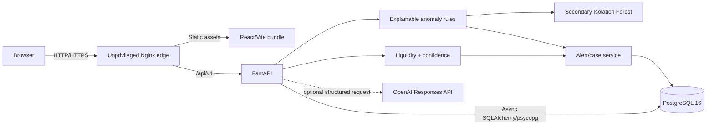

# Architecture

Provider e-money balances and shared physical cash are stored and forecast independently. FastAPI owns authentication, scope enforcement, analytics, scenario control, alert workflow, and audit writes. Isolation Forest is a secondary review signal and cannot override the rule evidence or trigger an action outside the human workflow.

The edge container is the only public application service. It serves the compiled SPA and proxies `/api/` to FastAPI, avoiding browser CORS complexity. PostgreSQL and FastAPI remain on the internal Compose network.

AI is an optional presentation-assistance branch, disabled by default. It receives only allow-listed synthetic alert context, uses structured outputs with `store=false`, and cannot create alerts, transition cases, or initiate an operational or financial action. Approved results are cached in PostgreSQL by a canonical SHA-256 context key.
