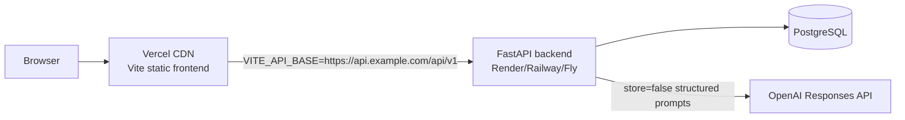

# Deploy the Frontend on Vercel with OpenAI Enabled

This repository is a PRD-aligned FastAPI + PostgreSQL backend with a Vite/React frontend. The safest Vercel deployment is:

- Vercel hosts the static frontend.
- Render, Railway, Fly.io, or another always-on Python host runs the FastAPI backend and PostgreSQL.
- OpenAI is configured only on the backend service, not in the browser.

The zip file `sali-project.zip` was reviewed as a separate Next.js/Prisma/SQLite prototype. It is useful reference material for demo copy and Vercel notes, but it should not replace this repository because it uses a different data model and weaker AI safety boundaries.

## Why not put everything on Vercel?

Vercel supports Vite static apps and can run FastAPI as a Python Function. Vite apps need `VITE_`-prefixed variables at build time, and SPAs need a rewrite to `index.html` for deep links. FastAPI on Vercel is packaged as a single serverless function with function-size and runtime limits. This app depends on Alembic migrations, PostgreSQL, async database sessions, scenario recomputation, and optional scikit-learn, so an always-on backend service is a better fit for the hackathon demo.

## Architecture



## 1. Deploy the backend first

Use the existing Render guide if you want the fastest path: [Render deployment](render-deployment.md).

Set these backend environment variables:

```dotenv
APP_ENV=production
DATABASE_URL=<your-postgres-sqlalchemy-url>
JWT_SECRET=<at-least-32-random-characters>
CORS_ORIGINS=https://<your-vercel-project>.vercel.app,http://localhost:5173
AI_ENABLED=true
OPENAI_API_KEY=<set this directly in the host dashboard>
OPENAI_MODEL=gpt-5.4-mini
AI_MAX_OUTPUT_TOKENS=500
AI_TIMEOUT_SECONDS=12
AI_CACHE_TTL_MINUTES=60
AI_PRICING_VERSION=<pricing-source-label-you-control>
AI_INPUT_COST_PER_MILLION=<your-configured-input-rate>
AI_OUTPUT_COST_PER_MILLION=<your-configured-output-rate>
RATE_LIMIT_ENABLED=true
RATE_LIMIT_STORAGE_URI=memory://
```

Do not paste the OpenAI key into source code, `.env.example`, GitHub issues, chat logs, screenshots, or commits. Put it only in the deployment provider's encrypted environment variable UI.

After backend deployment, verify:

```bash
curl -fsS https://<backend-host>/api/v1/health
curl -fsS https://<backend-host>/api/v1/ready
curl -fsS https://<backend-host>/api/v1/ai/status
```

`/ai/status` requires authentication in the app, so a plain curl may return `401`. That is acceptable; it means the route exists behind auth.

## 2. Deploy the frontend to Vercel

From the Vercel dashboard:

1. Import the GitHub repository.
2. Select the branch you want to deploy, for example `vercel-openai-zip-implementation`.
3. Keep the root directory as the repository root. The included `vercel.json` builds `frontend/`.
4. Add frontend environment variables:

```dotenv
VITE_API_BASE=https://<backend-host>/api/v1
VITE_MAP_TILE_URL=
VITE_MAP_ATTRIBUTION=
```

5. Deploy.

The included `vercel.json` uses:

```json
{
  "installCommand": "cd frontend && npm ci",
  "buildCommand": "cd frontend && npm run build",
  "outputDirectory": "frontend/dist"
}
```

The SPA rewrite sends deep links like `/alerts/<id>` back to `index.html`. API calls do not need a Vercel rewrite because `VITE_API_BASE` should point directly to the deployed backend URL.

## 3. Connect CORS

After Vercel gives you a URL, update the backend `CORS_ORIGINS`:

```dotenv
CORS_ORIGINS=https://<your-vercel-project>.vercel.app,http://localhost:5173
```

Redeploy or restart the backend after changing CORS.

## 4. Verify the app

Open the Vercel URL and sign in with a demo account:

```text
admin / demo-pass
operations / demo-pass
risk / demo-pass
management / demo-pass
agent / demo-pass
```

Recommended smoke path:

1. Log in as `admin`.
2. Open Demo Control and load Scenario B.
3. Open an alert detail page.
4. Confirm the AI panel appears.
5. Run Summary, Translate, and Recommendations.
6. Confirm responses say `source: openai` or `source: cache`.
7. Confirm all recommendations remain advisory and require human review.

If AI is disabled or the key is missing, the AI controls are hidden and the core workflow still works.

## 5. Deploy with the Vercel CLI

Only use the CLI if you are comfortable authenticating locally:

```bash
npm install -g vercel
vercel login
vercel --prod
```

When prompted:

- Framework preset: Vite.
- Build command: `cd frontend && npm run build`.
- Output directory: `frontend/dist`.
- Install command: `cd frontend && npm ci`.

Add environment variables with the dashboard, or with CLI commands:

```bash
vercel env add VITE_API_BASE production
vercel env add VITE_MAP_TILE_URL production
vercel env add VITE_MAP_ATTRIBUTION production
```

Do not add `OPENAI_API_KEY` to the Vercel frontend project. It belongs on the backend service only.

## Troubleshooting

### The page loads but login fails

Check `VITE_API_BASE`. It must include `/api/v1`, for example:

```dotenv
VITE_API_BASE=https://super-agent-api.onrender.com/api/v1
```

Then redeploy the frontend because Vite embeds `VITE_*` variables during build.

### Browser CORS error

Add the Vercel URL to backend `CORS_ORIGINS`, restart the backend, and try again.

### AI panel is missing

Check backend env:

```dotenv
AI_ENABLED=true
OPENAI_API_KEY=<configured>
```

Then log in and open an alert detail page. The frontend only shows AI actions when `GET /ai/status` returns `enabled: true`.

### AI falls back instead of using OpenAI

Look at backend logs for provider timeout, 429, 5xx, or structured-output validation errors. Fallback is expected and safe when the provider is unavailable.

### Vercel deploy builds but routes show 404 on refresh

Confirm the root `vercel.json` was included in the deployed branch. Its rewrite is required for React Router deep links.
